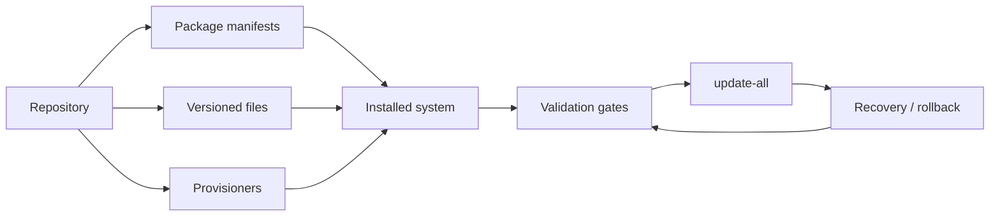

<p align="center">
  
</p>

<p align="center">
  A reproducible Linux desktop blueprint for a fast Hyprland workstation with
  deliberate packages, recoverable updates, and inspectable operations.
</p>

<p align="center">
  <a href="docs/09-installation-guide.md">Install</a>
  ·
  <a href="docs/05-post-install-validation.md">Validate</a>
  ·
  <a href="docs/07-snapshot-recovery-behavior.md">Recover</a>
  ·
  <a href="docs/adr">ADRs</a>
</p>

## Why Margine

Margine is not a frozen distro spin and not a dotfiles dump. It is a versioned
system definition: manifests decide what is installed, provisioners explain how
it reaches the machine, validators prove the result, and recovery paths stay
part of the normal workflow.

The current public product targets an Arch-based Hyprland desktop. The same
shared machinery also supports private products without mixing personal or
non-redistributable state into this public repository.

## What You Get

| Area | Margine baseline |
| --- | --- |
| Desktop | Hyprland-first Wayland session, Walker launcher, Fuzzel fallback, tuned window rules |
| Updates | `update-all` orchestration with explicit official/AUR/Flatpak boundaries |
| Recovery | Limine boot entries, UKIs, diagnostics, rollback-oriented update flow |
| Storage | LUKS2 + Btrfs/Snapper for the public Arch path; validated LUKS2 + root-on-ZFS flow for CachyOS/personal products |
| Hardware | Framework Laptop 13 AMD as reference hardware, with generic paths kept explicit |
| Gaming | Compatibility runtime by default; launchers and heavier app choices stay optional |
| Operations | Shell scripts, ADRs, runbooks, and validation gates instead of hidden installer magic |
| Identity | Margine logo, Plymouth theme, boot splash assets, and `margine-fetch` terminal branding |

## Architecture At A Glance



## Products

This repository contains the redistributable side of Margine:

- [`margine-public`](products/margine-public.toml): Arch base, Limine boot,
  shared Hyprland desktop, public package policy.

The private/personal line lives in a sister repository and imports shared logic
from here while keeping private manifests and CachyOS-specific experiments out
of the public tree.

## Repository Map

- [`products/`](products): product definitions and install targets
- [`manifests/`](manifests): package layers and flavor overlays
- [`files/`](files): files installed into `/etc`, `/usr`, and user homes
- [`scripts/`](scripts): install, update, repair, branding, and validation tools
- [`docs/adr/`](docs/adr): architectural decisions
- [`docs/runbooks/`](docs/runbooks): operational procedures
- [`docs/learning/`](docs/learning): research notes and design learning
- [`inventory/`](inventory): hardware and machine observations

## Quick Start

Prepare a QEMU validation VM:

```bash
./scripts/prepare-qemu-archiso-validation --product margine-public --download-iso
```

Run the live installer from a mounted repo:

```bash
./scripts/install-live-iso-guided --product margine-public
```

Update an installed Margine system:

```bash
update-all
```

Refresh branding in an installed QEMU guest over SSH:

```bash
./scripts/apply-qemu-branding-assets-over-ssh --user USERNAME --prompt-sudo
```

Refresh the desktop/app configuration and current font theme in an installed
QEMU guest over SSH:

```bash
./scripts/apply-qemu-user-app-config-over-ssh --user USERNAME --prompt-sudo
```

## Validation

Before treating installation changes as safe, run:

```bash
./scripts/validate-installation-pipeline
./scripts/check-shell-and-manifests
./scripts/check-bash-errexit-footguns
git diff --check
```

Installed-system validation starts from:

- [Post-install validation](docs/05-post-install-validation.md)
- [Host sync workflow](docs/06-host-sync-workflow.md)
- [Snapshot recovery behavior](docs/07-snapshot-recovery-behavior.md)
- [Permanent rollback from snapshot](docs/08-permanent-rollback-from-snapshot.md)
- [Boot security and TPM2](docs/11-boot-security-and-tpm2.md)
- [Branding assets](docs/runbooks/margine-branding-assets.md)
- [Root-on-ZFS update rollback](docs/runbooks/root-on-zfs-update-rollback.md)

## Status

Margine is in active system-integration work. The public Arch product remains
the redistributable baseline. Root-on-ZFS is now a validated product path for
the CachyOS/personal line, with generic validators and rollback tooling kept in
this public repository. Treat Btrfs/Snapper documents as the public/legacy host
path unless a page explicitly says root-on-ZFS.
